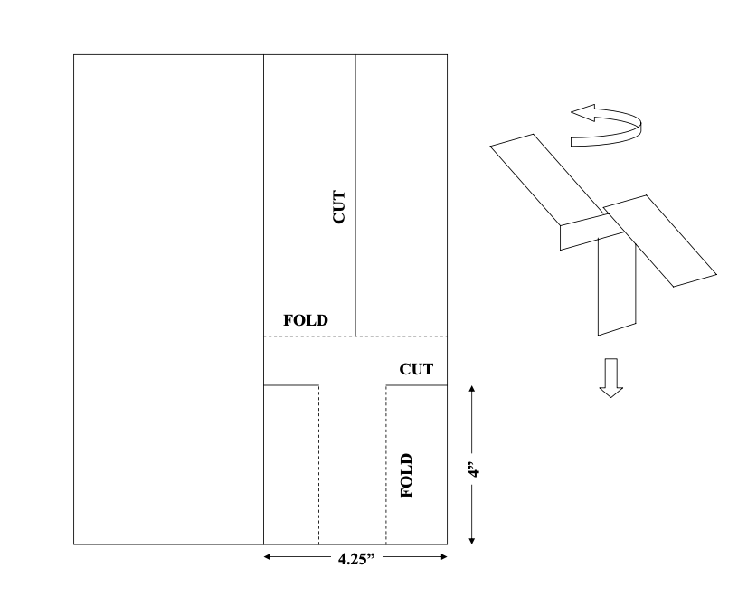
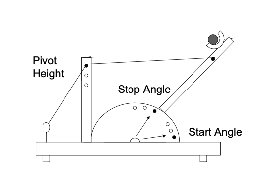

```{r setup, include=FALSE}
knitr::opts_chunk$set(echo = TRUE)

require('daewr')
require('ggplot2')
```

## Instruction:

Please type your answers clearly and show your work neatly. You are encouraged to use the Rmarkdown version of this assignment as a template to submit your work. Unless stated otherwise, all programming references in the assignment will be in R. For this assignment, problems roughly covers content from Complete Random Design and Factorial Designs


### Problem 1 
Describe a situation within your realm of experience (your work, your hobby, or school) where you might like to predict result of some future action. Explain how experimental design, rather than observational study, might enhance your ability to make this prediction.

### Problem 2
Paper helicopters can be cut from one half of an 812 ×11 sheet of paper as shown below.
```{r, echo=FALSE, fig.align='center',fig.cap="Figure 1", out.width = '50%'}

```
These helicopters can be made quickly and inexpensively, and can be used to demonstrate experimental design concepts. An experiment can be per- formed by constructing a helicopter, dropping it from a fixed height, and clocking the time it takes to rotate to the floor, as shown above, with a stopwatch. The wing length could be varied by trimming some paper off the top prior to folding the wings. Trimming some paper off would reduce the weight of the helicopter, but would also result in less surface area on the blades. You could experiment to determine if changing the wing length affects the flight time.

(a) Describe the experimental unit.
(b) Explain the difference in replicates and duplicates for this situation.
(c) Describe the treatment factor.
(d) Describe any lurking variables that might affect the results of experi-
ments.
(e) Explain why randomization would be important.

### Problem 3
In an experiment to study the effect of the amount of baking powder in a biscuit dough upon the rise heights of the biscuits, four levels of baking powder were tested and four replicate biscuits were made with each level in a random order. The results are shown in the table below.

| .25 tsp | .5 tsp | .75 tsp | 1 tsp |
|---------|--------|---------|-------|
| 11.4    | 27.8   | 47.6    | 61.6  |
| 11.0    | 29.2   | 47.0    | 62.4  |
| 11.3    | 26.8   | 47.3    | 63.0  |
| 9.5     | 26.0   | 45.5    | 63.9  |

(a) What is the experimental unit?
(b) Perform the analysis of variance to test the hypothesis of no treatment effect.
(c) Formulate a contrast to test the hypothesis that increase in rise height is a linear function of the increase in baking powder in the dough, and test this hypothesis.
(d) Estimate the variance of the experimental error $\sigma^2$.
(e) Make a plot of residuals vs predicted values and normal plot of residuals and comment on whether the assumptions of the linear model are justified.
(f) If the dough were made in batches and the four replicate the biscuit rise heights in each column (shown in the table above) were all from the same batch, would you answer to (a) be different? How could the data be analyzed if this were the case?  

### Problem 4
Consider an experimental situation where the investigator was interested in detecting a maximum difference in treatment means that is twice the standard deviation of the response measured on replicate experimental units assigned to the same level of the treatment factor, that is $\Delta = 2\sigma.$ If there are 4 levels of the treatment factor:
(a) Modify the R code in Section 2.7 (of the DAE with R text) to calculate the power of various numbers of replicates $r$ per treatment level.
(b) Calculate the number of replicates necessary to have 0.9 power of detecting a difference as large as $\Delta = 2\sigma$
(c) How would the result you got in (b) change if the number of levels of the treatment factor increased to 8, or decreased to 2?


### Problem 5
A wooden catapult can be used to flip a foam ball. The catapult has three factors that can be adjusted: the start angle, the stop angle, and the pivot height. The distance the ball travels can be measured with a tape measure.

```{r, echo=FALSE, fig.align='center',fig.cap="Figure 1", out.width = '50%'}

```

(a) If experiments were to be conducted with the catapult by flipping the ball and measuring the distance, what would the experimental unit be?
(b) Using the numbers 1, 2, and 3 to represent the levels of start angle and stop angle, and holding the pivot height constant at its high level, make
a randomized list of experiments for a 3×3 factorial experiment with r = 2 replicates per cell.
(c) If the variance of the experimental error in the measured distance was $\sigma^2$ = 12 inches, calculate the number of replicates you would need to have a power of 0.90 for detecting a difference in 10 inches in cell means.
(d) Calculate the number of replicates you would need to have a power of 0.90 for detecting a difference of 24 inches in marginal means for either factor.
(e) If a catapult is available, conduct the list of experiments you wrote in part (b).
(f) Calculate the ANOVA with your resulting data and test the main effects and interaction.
(g) Explain or interpret any significant effects (use graphs if necessary to aid in your explanation).