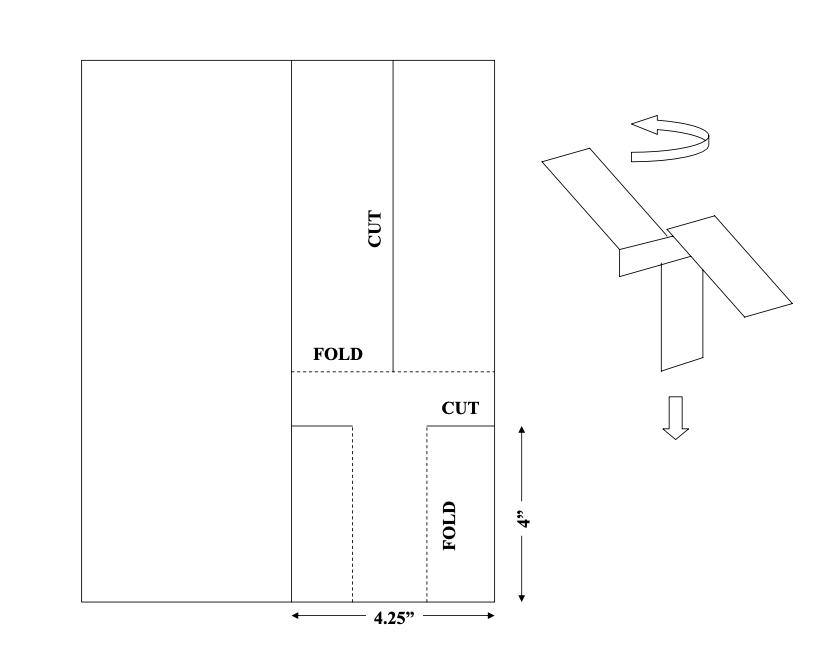

```{r setup, include=FALSE}
knitr::opts_chunk$set(echo = TRUE)

require('daewr')
require('ggplot2')
require('pander')
require('dplyr')
```

## Instruction:

Please type your answers clearly and show your work neatly. You are encouraged to use the Rmarkdown version of this assignment as a template to submit your work. Unless stated otherwise, all programming references in the assignment will be in R. For this assignment, problems roughly covers content from Complete Random Design and Factorial Designs


### Problem 1 
Describe a situation within your realm of experience (your work, your hobby, or school) where you might like to predict result of some future action. Explain how experimental design, rather than observational study, might enhance your ability to make this prediction.

### Problem 2
Paper helicopters can be cut from one half of an 812 ×11 sheet of paper as shown below.
```{r, echo=FALSE, fig.align='center',fig.cap="Figure 1", out.width = '50%'}

```
These helicopters can be made quickly and inexpensively, and can be used to demonstrate experimental design concepts. An experiment can be performed by constructing a helicopter, dropping it from a fixed height, and clocking the time it takes to rotate to the floor, as shown above, with a stopwatch. The wing length could be varied by trimming some paper off the top prior to folding the wings. Trimming some paper off would reduce the weight of the helicopter, but would also result in less surface area on the blades. You could experiment to determine if changing the wing length affects the flight time.

(a) Describe the experimental unit.
Paper templates that are used to make the helicoptors (or paper helicoptors)
(b) Explain the difference in replicates and duplicates for this situation.

In this case, measurement collected from replicates would be the different paper planes that are subjected to specific treatment levels based on the experimental plan, we consider them different samples and therefore produce independent responses. The same cannot be said for duplicates, which produces measurements multiple times on the same E.U. Responses from duplicated measurements should be averaged to avoid bias to the results. See p.3-4 of Lawson for more detail.  

(c) Describe the treatment factor.

The treatment factor would be wing length in this case.


(d) Describe any lurking variables that might affect the results of experiments.

Lurking variables are variables that are not considered in the study but could influence the relationship between the response and the treatment variables. Many things could be lurking variables in this experiment - for example the weight of the paper, the individual holding and dropping the helicopter, breeze in the environment, etc. 

(e) Explain why randomization would be important.

The main purpose of randomization is to prevent biases eliminate affect of possible lurking variables that can be reflected in the responses. It is a way to control sources of variation in the data so that experimenters can better identify evidence for any causal effect that arise from the factors being studied.


### Problem 3
In an experiment to study the effect of the amount of baking powder in a biscuit dough upon the rise heights of the biscuits, four levels of baking powder were tested and four replicate biscuits were made with each level in a random order. The results are shown in the table below.

| .25 tsp | .5 tsp | .75 tsp | 1 tsp |
|---------|--------|---------|-------|
| 11.4    | 27.8   | 47.6    | 61.6  |
| 11.0    | 29.2   | 47.0    | 62.4  |
| 11.3    | 26.8   | 47.3    | 63.0  |
| 9.5     | 26.0   | 45.5    | 63.9  |

(a) What is the experimental unit?

The experimental units are the individual pieces of biscuit dough 

(b) Perform the analysis of variance to test the hypothesis of no treatment effect.

This experiment can be  expressed as a cell means model $y_{ij} = \mu_i + \epsilon_{ij},$ or _effects model_ $y_{ij} = \mu +\tau_i + \epsilon_{ij},$ where $ i= 1,2,3,4 $ are the treatment/ factor levels, $j = 1,2,3,4$ are the replicates. The hypothesis being tested is the following :\[H_0: \mu_1 = \mu_2 = \mu_3 = \mu_4, H_a : \mu_i\neq \mu_k \text{ for some } i,k \in \{1,2,3,4\}\]

To perfom the ANOVA, first let's create the dataset:

```{r}
# create dataset called 'biscuit'
id <- rep(c("A", "B", "C", "D"), each = 4)

fac <- factor(rep(c(0.25, 0.5, 0.75, 1), each = 4))


resp <- c(11.4, 11.0, 11.3, 9.5,
          27.8, 29.2, 26.8, 26.0, 
          47.6, 47.0, 47.3, 45.5,
          61.6, 62.4, 63.0, 63.9)

biscuit <- data.frame(id, treatment = fac, response = resp)

```

We can then use `aov` to create the ANOVA object in `R`. Based on the p-value for the F-statistic, and the significance level $\alpha = 0.05$, we can reject the $H_0$, which suggests the treatment effect may be statistically significant.

```{r}

biscuit_aov <- aov(response ~ treatment, data = biscuit)
pander(summary(biscuit_aov))

```


(c) Formulate a contrast to test the hypothesis that increase in rise height is a linear function of the increase in baking powder in the dough, and test this hypothesis.

In here, we can use the R function `contr.poly(n)` to create contrast matrices based on orthogonal polynomials , where $n$ is the number of levels being tested. Based on the summary of the effects, the linear trend appears to be significant.

```{r}
contrasts(biscuit$treatment) <- contr.poly(4)
matplot(levels(biscuit$treatment),contrasts(biscuit$treatment),
        type="b",lwd = 2,main = 'contrast coefficients', xlab = 'factor levels')

pander(summary.lm())

```

(d) Estimate the variance of the experimental error $\sigma^2$.

The model error, $\sigma^2$ can be estimated as $\sum_{i=1}^{t}\sum_{j=1}^{r_i}(y_{ij}-\hat{\mu}_i)^2 / (n-t)$, where $\mu_i = \sum_{j=1}^{r_i} y_{ij}/r_i$ is the average effect from treatment $i$

In `R`, we can use the following implementation to calculate $\hat{\sigma^2}$: 

```{r}
## collect the needed statistics 
biscuit_stats<-biscuit%>%group_by(treatment)%>%
  summarise(mu_i = mean(response),
            s_i=sum((response-mean(response))^2))
pander(biscuit_stats)
## calculate s^2
sigma2 = sum(biscuit_stats$s_i)/(nrow(biscuit)-4)
print(paste0('s^2 = ',round(sigma2,2)))
```

Alternatively, we can use the ANOVA table supplied by the 'aov' function, note that the Residuals Sum Sq = 13.49 and the corresponding df = 16-4 = 12, $13.49/12 = 1.12$

(e) Make a plot of residuals vs predicted values and normal plot of residuals and comment on whether the assumptions of the linear model are justified.

From the normal q-q plot, we can see that the residuals are not quite normally distributed, over on the left the residuals vs fitted value plot also show that the spread of residuals are not exactly the same across treatment levels. For example, responses from the baking powder level of 0.25 tsp show a wider spread relative to the other levels, indicating the non-constant variance assumption may be violated. However, there is a level of subjectivity on the conclusion here, so one could argue both ways. The best way to check in this case is increase the number of sample size if possible.

```{r}
par(mfrow=c(1,2))
plot(biscuit_aov,which = 1)
plot(biscuit_aov,which = 2)
```
(f) If the dough were made in batches and the four replicate the biscuit rise heights in each column (shown in the table above) were all from the same batch, would you answer to (a) be different? How could the data be analyzed if this were the case?  

The experimental unit in this case would be individual batches, while modeling the data one should include a variable that accounts for batches as a source of variation.

### Problem 4
Consider an experimental situation where the investigator was interested in detecting a maximum difference in treatment means that is twice the standard deviation of the response measured on replicate experimental units assigned to the same level of the treatment factor, that is $\Delta = 2\sigma.$ If there are 4 levels of the treatment factor:
(a) Modify the R code in Section 2.7 (of the DAE with R text) to calculate the power of various numbers of replicates $r$ per treatment level.

We only need to modify the value of $\Delta$ and `nlev` in this case, assuming $\sigma^2$ given in the book example stays the same. Below is the result. 

```{r}
rmin <- 2
rmax <- 10
alpha <-rep(0.05, rmax - rmin +1)
sigma <- sqrt(2.1)
Delta <- 2 * sigma
nlev <- 4
nreps <- rmin:rmax
power <- Fpower1(alpha, nlev, nreps, Delta, sigma)
pander(power)

```

(b) Calculate the number of replicates necessary to have 0.9 power of detecting a difference as large as $\Delta = 2\sigma$

Based on the result above, 9 replicates to reach a power of 0.9 of detecting the said difference.

(c) How would the result you got in (b) change if the number of levels of the treatment factor increased to 8, or decreased to 2?

We can write a simple function to find that out. (Note - I don't expect this to be the 'correct answer', you can simply run the above code twice and produce the same answer as well).

```{r}
## function with default value 
find_max_rep <- function(nlev=4, rmin=2, rmax = 15, minpower=0.9){

alpha <-rep(0.05, rmax - rmin +1)
sigma <- sqrt(2.1)
Delta <- 2 * sigma
nreps <- rmin:rmax
power <- data.frame(Fpower1(alpha, nlev, nreps, Delta, sigma))
min_rep <-min(power[power$power>=minpower,'nreps'])
print(paste0('the min. number of reps to reach power of ',
             minpower, ' is ',
             min_rep,' when the number of treatment levels is ', 
             nlev))
return(min_rep)

}

```

```{r}
ans1 <- find_max_rep(nlev=2)

```


```{r}
ans2 <- find_max_rep(nlev=8)
```

### Problem 5
A wooden catapult can be used to flip a foam ball. The catapult has three factors that can be adjusted: the start angle, the stop angle, and the pivot height. The distance the ball travels can be measured with a tape measure.

```{r, echo=FALSE, fig.align='center',fig.cap="Figure 1", out.width = '50%'}
knitr::include_graphics("catapult.png")
```

(a) If experiments were to be conducted with the catapult by flipping the ball and measuring the distance, what would the experimental unit be?

The E.U. would be the act of flipping the ball with the catapult.

(b) Using the numbers 1, 2, and 3 to represent the levels of start angle and stop angle, and holding the pivot height constant at its high level, make
a randomized list of experiments for a 3×3 factorial experiment with r = 2 replicates per cell.

The R code [two_factor_plan.R](https://github.com/samimath/experimental_design/blob/main/lecture4/two_factor_plan.R) provides the steps needed, also shown below:

```{r}
## 1. creating a 2-factor design plan
# creating grid for levels of different factors:

D <- expand.grid( start_angle = c(1, 2, 3), stop_angle = c(1, 2, 3) )
D

## create 2 reps per combination of level
D1<-rbind(D,D)

## 2. randomizing order of the runs
set.seed(2023)
D2<-D1[order(sample(1:nrow(D1))),]
pander(D2)

```
(c) If the variance of the experimental error in the measured distance was $\sigma^2$ = 12 inches, calculate the number of replicates you would need to have a power of 0.90 for detecting a difference in 10 inches in cell means.

Using `Fpower1` to perform the power calculation, we can see that it'll take 6 reps.

```{r}
rmin = 2
rmax = 8
nlev = 9
alpha <-rep(0.05, rmax - rmin +1)
sigma <- sqrt(12)
Delta <- 10
nreps <- rmin:rmax
power <- data.frame(Fpower1(alpha, nlev, nreps, Delta, sigma))
pander(power[power$power>=0.9,]) 

```
(d) Calculate the number of replicates you would need to have a power of 0.90 for detecting a difference of 24 inches in marginal means for either factor.

In this case, we can use `Fpower2` as we are looking to assess marginal effects. It takes 2 reps to achieve a power of 0.9 to pick up the said effect, this is an example of the benefit of hidden replicates in factorial designs. Note that, if $\Delta$ is decreased, you'll see that the number of reps required will increase as a result. In general, the higher $\Delta/\sigma$ is, the less number of reps we'll need, and vice versa.

```{r}
rmin = 2
rmax = 5
nlev = c(3,3)
alpha <-rep(0.05, rmax - rmin +1)
sigma <- sqrt(12)
Delta <- 10
nreps <- rmin:rmax
power <- data.frame(Fpower2(alpha, nlev, nreps, Delta, sigma))
pander(power)

```

